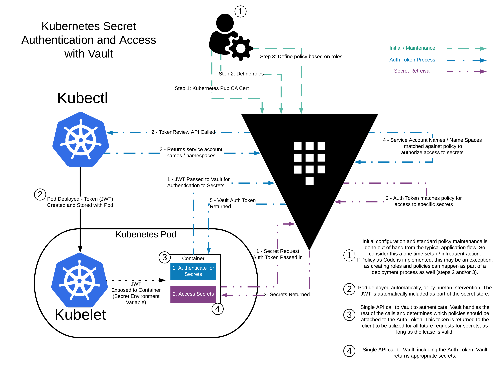

# Vault Agent Guide  <!-- omit in toc -->

The purpose of this guide is to provide working examples on how to use the Vault Agent. Vault Agent is a client daemon that can perform useful tasks. Currently, it provides a mechanism for easy authentication to Vault in a wide variety of environments. The documentation for using Vault Agent can be found [here](https://www.vaultproject.io/docs/agent/).

- [The Challenge](#the-challenge)
- [Background](#background)
- [Vault Agent Auto-Auth Overview](#vault-agent-auto-auth-overview)
- [EC2 Auto-Auth Using the AWS IAM Auth Method](#ec2-auto-auth-using-the-aws-iam-auth-method)
  - [Part 1: Configure the AWS IAM Auth Method](#part-1-configure-the-aws-iam-auth-method)
  - [Part 2: Login Manually From the Client Instance](#part-2-login-manually-from-the-client-instance)
  - [Part 3: Using Vault Agent Auto-Auth on the Client Instance](#part-3-using-vault-agent-auto-auth-on-the-client-instance)
- [[WIP] Kubernetes: Pod Auto-Auth Using the Kubernetes Auth Method](#wip-kubernetes-pod-auto-auth-using-the-kubernetes-auth-method)
- [[WIP] OpenShift: Pod Auto-Auth Using the Kubernetes Auth Method](#wip-openshift-pod-auto-auth-using-the-kubernetes-auth-method)

## The Challenge

How to enable authentication to Vault and manage the lifecycle of tokens in a standard way (without having to write custom logic)?

## Background

Nearly all requests to Vault must be accompanied by an authentication token. This includes all API requests, as well as via the Vault CLI and other libraries.

Vault provides a number of different authentication methods to assist in delivery of this initial token (AKA secret zero). If you can securely get the first secret from an originator to a consumer, all subsequent secrets transmitted between this originator and consumer can be authenticated with the trust established by the successful distribution and user of that first secret. Getting the first secret to the consumer, is the **secure introduction** challenge.

To that end, Vault provides integration with native authentication capabilities in various environments, for example: IAM in [AWS](https://www.vaultproject.io/docs/auth/aws.html) and [Google Cloud](https://www.vaultproject.io/docs/auth/gcp.html), Managed Service Identities in [Azure](https://www.vaultproject.io/docs/auth/azure.html), and Service Accounts in [Kubernetes](https://www.vaultproject.io/docs/auth/kubernetes.html). Complete documentation for all Vault-supported authentication methods can be found [here](https://www.vaultproject.io/docs/auth/index.html).

However, even though Vault provides a number of mechanisms to support secure introduction, it's always been the responsibility of the client to write their own logic for enabling this behavior and managing the lifecycle of tokens.

## Vault Agent Auto-Auth Overview

To that end, HashiCorp has introduced the Vault Agent which provides a nunber of different helper features, specifically addressing the following challenges
 
- Automatic authentication
- Secure delivery/storage of tokens
- Lifecycle management of these tokens (renewal & reauthentication)

> ***NOTE:*** The Vault Agent Auto-Auth functionality addresses the challenges related to obtaining and managing ***authentication tokens only***.
> 
> Helper tools for obtaining and managing secrets stored in Vault (e.g. DB credentials, PKI certificates, AWS access keys, etc.) include [Consul Template](https://github.com/hashicorp/consul-template) and [Envconsul](https://github.com/hashicorp/envconsul). See the linked documentation for the respective tools for more information.

For documentation on both basic and advanced functionality, please refer to the Vault Agent Auto-Auth [documentation](https://www.vaultproject.io/docs/agent/autoauth/index.html).

To summarize, Vault Agent Auto-Auth relies on a configuration file that defines a "Method" which specifies parameters around what auth method to use and associated parameters as well as one or more "Sinks" which are locations where Vault Agent will write the acquired token to. Additionally, Sink configuration allows for [response-wrapping](https://www.vaultproject.io/docs/concepts/response-wrapping.html) (see [here](https://learn.hashicorp.com/vault/secrets-management/sm-cubbyhole) also) the tokens.

> ***NOTE:*** An experimental feature, which will not be covered in this guide, also allows for encrypting the tokens. Stay tuned for more detail on this...

This guide will focus on demonstrating the documented functionality using the following examples:

- EC2 authentication via the AWS IAM auth method
- Pod authentication via the Kubernetes auth method
- [Stretch] Combining AWS IAM auth with Nomad + Vault

## EC2 Auto-Auth Using the AWS IAM Auth Method

To complete this section of the guide, you will need the following:

- An AWS account and associated credentials that allow for the creation of resources
- A EC2 instance with and instance profile attached (the associated IAM policy for the instance profile is not relevant to the context of Vault)
- A running Vault cluster that is accessible from the EC2 instance identified above

For an example of quick-start Terraform code for deploying a single-node Vault cluster and a bare EC2 instance on which to test, please see [this repo](https://github.com/tdsacilowski/vault-demo/tree/master/terraform-aws).

> ***NOTE:*** The example Terraform code in the above repository is not suitable for production use. For examples on best-practices on deploying a Vault cluster, see [here](https://github.com/hashicorp/vault-guides/tree/master/operations/provision-vault) and [here](https://registry.terraform.io/modules/hashicorp/vault/aws/0.10.3).

### Part 1: Configure the AWS IAM Auth Method

In this section, we'll write some dummy data/policies and configure Vault to allow AWS IAM authentication from specifies IAM roles.

1. [From the Vault **Server**] If you haven't done so already, perform a `vault operator init`. Make sure to note down your unseal keys and initial root token in a safe place. You will need these in the following steps (in production, you would secure these in a much better way, or use auto-unseal).

2. [From the Vault **Server**] If your Vault server is sealed, perform the `vault operator unseal` operation using 3 different unseal keys.

3. [From the Vault **Server**] Login using your initial root token (or other administrative login that you might have already configured).

    ```
    $ vault login 8HFNOvljUno...

    Success! You are now authenticated. The token information displayed below
    is already stored in the token helper. You do NOT need to run "vault login"
    again. Future Vault requests will automatically use this token.

    Key                  Value
    ---                  -----
    token                8HFNOvljUno...
    token_accessor       2nwUJ6kFVqXps6QH4ahdDXzq
    token_duration       ∞
    token_renewable      false
    token_policies       ["root"]
    identity_policies    []
    policies             ["root"]
    ```

4. [From the Vault **Server**] Lets create some dummy data and a read-only policy for our clients:

    ```
    vault policy write myapp-kv-ro - <<EOH
    path "secret/myapp/*" {
        capabilities = ["read", "list"]
    }
    EOH

    vault kv put secret/myapp/config \
        ttl='30s' \
        username='appuser' \
        password='suP3rsec(et!'
    ```

5. Enable the aws auth method:

    ```
    $ vault auth enable aws

    Success! Enabled aws auth method at: aws/
    ```

6. [From the Vault **Server**] Next, configure the AWS credentials that Vault will use to verify login requests from AWS clients:
   
    ```
    $ vault write -force auth/aws/config/client

    Success! Data written to: auth/aws/config/client
    ```

    > ***NOTE:*** In the above example, I'm relying on an instance profile to provide credentials to Vault. See [here](https://www.vaultproject.io/docs/auth/aws.html#recommended-vault-iam-policy) for an example IAM policy to give Vault in order for it to handle AWS IAM auth. You can also pass in explicit credentials as such:

    ```
    $ vault write auth/aws/config/client secret_key=AWS_SECRET_ACCESS_KEY access_key=AWS_ACCESS_KEY_ID
    ```

7. Identify the IAM instance profile role associated with the client instance that you intend to authenticate from.
   
    If you're using the sample repo linked above in the intro, you'll have a `"${var.environment_name}-vault-client"` instance created for you with an instance profile role of `"${var.environment_name}-vault-client-role"`.

    If you're provisioning your own examples, spin up an EC2 instance and assign it any instance profile, the IAM role policy is not important from Vault's perspective. What *is* important is the fact that a `vault login` operation from the client instance can use the attached instance profile as a way to identify itself to Vault.

    [From the Vault **Server**] Configure a **Vault** role under the AWS authentication method that we configured in the previous step. A Vault auth role maps an AWS IAM role to a set of Vault policies (I'll reference the dummy policy created in step #4):
   
    ```
    $ vault write auth/aws/role/dev-role-iam auth_type=iam \
        bound_iam_principal_arn=arn:aws:iam::AWS_ACCOUNT_NUMBER:role/teddy-vault-demo-vault-client-role \
        policies=myapp-kv-ro \
        ttl=24h

    Success! Data written to: auth/aws/role/dev-role-iam
    ```

    > ***NOTE:*** To get your IAM role ARN, you'll need to go to the AWS console and find the role associated with the instance profile that you want to use as a source of authentication. If you're following along with the quick-start repo, the instance will have the AWS CLI installed and you can simply run the following to obtain information about the IAM role:

    ```
    $ aws iam get-role --role-name [VAR_ENVIRONMENT_NAME]-vault-client-role
    {
        "Role": {
            "Path": "/",
            "RoleName": "[VAR_ENVIRONMENT_NAME]-vault-client-role",
            "RoleId": "ROLE_ID_VALUE",
            "Arn": "arn:aws:iam::AWS_ACCOUNT_NUMBER:role/[VAR_ENVIRONMENT_NAME]-vault-client-role",
            "CreateDate": "2018-11-01T01:54:07Z",
            "AssumeRolePolicyDocument": {
                "Version": "2012-10-17",
                "Statement": [
                    {
                        "Sid": "",
                        "Effect": "Allow",
                        "Principal": {
                            "Service": "ec2.amazonaws.com"
                        },
                        "Action": "sts:AssumeRole"
                    }
                ]
            }
        }
    }
    ```

### Part 2: Login Manually From the Client Instance

Now that we've configured the appropriate AWS IAM auth method on our Vault server, let's SSH into our **client** instance and verify that we're able to successfully utilize the instance profile to login to Vault.

1. [From the Vault **Client**] Open a terminal on your client instance. If using the quick-start repo, the Vault binary should already be installed and configured to talk to your Vault server. You can check this by typing in `vault status`:

    ```
    $ vault status

    Key             Value
    ---             -----
    Seal Type       shamir
    Initialized     true
    Sealed          false
    Total Shares    5
    Threshold       3
    Version         0.11.4
    Cluster Name    vault-cluster-0c4710e6
    Cluster ID      34226d12-3707-6d75-8407-772b32ee4c40
    HA Enabled      true
    HA Cluster      https://active.vault-us-east-1.service.consul-us-east-1.consul:8201
    HA Mode         active
    ```

    If following with your own examples, make sure you've downloaded the appropriate [Vault binary](https://releases.hashicorp.com/vault/) and set your VAULT_ADDR environment variable, for example:

    ```
    export VAULT_ADDR=http://10.0.101.79:8200
    ```

2. [From the Vault **Client**] Using the Vault CLI, test the `login` operation:

    ```
    $ vault login -method=aws role=dev-role-iam

    Success! You are now authenticated. The token information displayed below
    is already stored in the token helper. You do NOT need to run "vault login"
    again. Future Vault requests will automatically use this token.

    Key                                Value
    ---                                -----
    token                              tBJ6tSUMGRm...
    token_accessor                     jgVEZtmy5DdkLnZ29yJfSP6g
    token_duration                     24h
    token_renewable                    true
    token_policies                     ["default" "myapp-kv-ro"]
    identity_policies                  []
    policies                           ["default" "myapp-kv-ro"]
    token_meta_client_user_id          CLIENT_USER_ID_VALUE
    token_meta_inferred_aws_region     n/a
    token_meta_inferred_entity_id      n/a
    token_meta_inferred_entity_type    n/a
    token_meta_account_id              AWS_ACCOUNT_NUMBER
    token_meta_auth_type               iam
    token_meta_canonical_arn           arn:aws:iam::AWS_ACCOUNT_NUMBER:role/teddy-vault-demo-vault-client-role
    token_meta_client_arn              arn:aws:sts::AWS_ACCOUNT_NUMBER:assumed-role/teddy-vault-demo-vault-client-role/i-03d2b2...
   ```

3. [From the Vault **Client**] We can also check to make sure that the token has the appropriate permissions to read our secrets:

    ```
    $ vault kv get secret/myapp/config

    ====== Data ======
    Key         Value
    ---         -----
    password    suP3rsec(et!
    ttl         30s
    username    appuser
    ```

### Part 3: Using Vault Agent Auto-Auth on the Client Instance

In this section we'll take everything we've done so far and apply it to the Vault Agent Auto-Auth method and write out a token to an arbitrary location on disk.

1. [From the Vault **Client**] First, we'll create a configuration file for the Vault Agent to use:

    ```
    tee /home/ubuntu/auto-auth-conf.hcl <<EOF
    exit_after_auth = true
    pid_file = "./pidfile"

    auto_auth {
        method "aws" {
            mount_path = "auth/aws"
            config = {
                type = "iam"
                role = "dev-role-iam"
            }
        }

        sink "file" {
            config = {
                path = "/home/ubuntu/vault-token-via-agent"
            }
        }
    }
    EOF
    ```

    In this file, we're telling Vault Agent to use the `aws` auth method, located at the path `auth/aws` on our Vault server, authenticating against the IAM role `dev-role-iam`.

    We're also identifying a location on disk where we want to place this token. The `sink` block can be configured multiple times if we want Vault Agent to place the token into multiple locations.

2. [From the Vault **Client**] Now we'll run the Vault Agent with the above config:

    ```
    $ vault agent -config=/home/ubuntu/auto-auth-conf.hcl -log-level=debug

    ==> Vault agent configuration:

                        Cgo: disabled
                Log Level: debug
                    Version: Vault v0.11.4
                Version Sha: 612120e76de651ef669c9af5e77b27a749b0dba3

    ==> Vault server started! Log data will stream in below:

    2018-11-01T04:04:50.407Z [INFO]  sink.file: creating file sink
    2018-11-01T04:04:50.408Z [INFO]  sink.file: file sink configured: path=/home/ubuntu/vault-token-via-agent
    2018-11-01T04:04:50.410Z [INFO]  sink.server: starting sink server
    2018-11-01T04:04:50.410Z [INFO]  auth.handler: starting auth handler
    2018-11-01T04:04:50.410Z [INFO]  auth.handler: authenticating
    2018-11-01T04:04:50.443Z [INFO]  auth.handler: authentication successful, sending token to sinks
    2018-11-01T04:04:50.443Z [INFO]  auth.handler: starting renewal process
    2018-11-01T04:04:50.443Z [INFO]  sink.file: token written: path=/home/ubuntu/vault-token-via-agent
    2018-11-01T04:04:50.443Z [INFO]  sink.server: sink server stopped
    2018-11-01T04:04:50.443Z [INFO]  sinks finished, exiting
    ```

    > ***NOTE:*** In this example, because our `auto-auth-conf.hcl` configuration file contained the line "`exit_after_auth = true`", Vault Agent simply authenticated and retrieved a token once, wrote it to the defined sink, and exited. Vault Agent can also run in daemon mode where it will continuously renew the retrieved token, and attempt to re-authenticate if that token becomes invalid.

3. [From the Vault **Client**] Let's try an API call using the token that Vault Agent pulled for us to test:

    ```
    $ curl \
        --header "X-Vault-Token: $(cat /home/ubuntu/vault-token-via-agent)" \
        $VAULT_ADDR/v1/secret/myapp/config | jq
    
    {
        "request_id": "af09f402-05ad-31e2-ac3d-05aae441fd51",
        "lease_id": "",
        "renewable": false,
        "lease_duration": 30,
        "data": {
            "password": "suP3rsec(et!",
            "ttl": "30s",
            "username": "appuser"
        },
        "wrap_info": null,
        "warnings": null,
        "auth": null
    }
    ```

4. [From the Vault **Client**] In addition to pulling a token and writing it to a location in plaintext, Vault Agent supports response-wrapping of the token, which provides an additional layer of protection for the token. Tokens can be wrapped by either the auth method or by the sink configuration, with each approach solving for different challenges, as described [here](https://www.vaultproject.io/docs/agent/autoauth/index.html#response-wrapping-tokens). In the following example, we will use the sink method.

    [From the Vault **Client**] Let's update our `auto-auth-conf.hcl` file to indicate that we want the Vault token to be response-wrapped when written to the defined sink:

    ```
    tee /home/ubuntu/auto-auth-conf.hcl <<EOF
    exit_after_auth = true
    pid_file = "./pidfile"

    auto_auth {
        method "aws" {
            mount_path = "auth/aws"
            config = {
                type = "iam"
                role = "dev-role-iam"
            }
        }

        sink "file" {
            wrap_ttl = "5m"
            config = {
                path = "/home/ubuntu/vault-token-via-agent"
            }
        }
    }
    EOF
    ```

5. [From the Vault **Client**] Let's run the Vault Agent and inspect the output:

    ```
    $ vault agent -config=/home/ubuntu/auto-auth-conf.hcl -log-level=debug
    ==> Vault agent configuration:

                        Cgo: disabled
                Log Level: debug
                    Version: Vault v0.11.4
                Version Sha: 612120e76de651ef669c9af5e77b27a749b0dba3

    ==> Vault server started! Log data will stream in below:

    2018-11-01T05:56:47.709Z [INFO]  sink.file: creating file sink
    2018-11-01T05:56:47.709Z [INFO]  sink.file: file sink configured: path=/home/ubuntu/vault-token-via-agent
    2018-11-01T05:56:47.711Z [INFO]  sink.server: starting sink server
    2018-11-01T05:56:47.711Z [INFO]  auth.handler: starting auth handler
    2018-11-01T05:56:47.711Z [INFO]  auth.handler: authenticating
    2018-11-01T05:56:47.738Z [INFO]  auth.handler: authentication successful, sending token to sinks
    2018-11-01T05:56:47.738Z [INFO]  auth.handler: starting renewal process
    2018-11-01T05:56:47.749Z [INFO]  auth.handler: renewed auth token
    2018-11-01T05:56:47.756Z [INFO]  sink.file: token written: path=/home/ubuntu/vault-token-via-agent
    2018-11-01T05:56:47.756Z [INFO]  sink.server: sink server stopped
    2018-11-01T05:56:47.756Z [INFO]  sinks finished, exiting

    $ cat /home/ubuntu/vault-token-via-agent | jq

    {
        "token": "72gNHzRSoxPMEbMXWGZGu8Nh",
        "accessor": "1e2dYc4L4RqUoGKBlmu2N2vf",
        "ttl": 300,
        "creation_time": "2018-11-01T06:03:59.682885269Z",
        "creation_path": "sys/wrapping/wrap",
        "wrapped_accessor": ""
    }
    ```

    Here we see that instead of a simple token value, we have a JSON object containing a response-wrapped token as well as some additional metadata. In order to get to the true token, we need to first perform an unwrap operation.

6. [From the Vault **Client**] Let's unwrap the response-wrapped token and save it to a `VAULT_TOKEN` env var that other applications can use:

    ```
    $ export VAULT_TOKEN=$(vault unwrap -field=token $(jq -r '.token' /home/ubuntu/vault-token-via-agent))

    $ echo $VAULT_TOKEN
    5twYDIqsxyVLMJ9MYFNKPWXG
    ```

    Notice that the value saved to the `VAULT_TOKEN` is not the same as the `token` value in the file `/home/ubuntu/vault-token-via-agent`. The value in `VAULT_TOKEN` is the unwrapped token retrieved by Vault Agent. Additionally, note that if we try to unwrap that same value again, we get an error:

    ```
    $ export VAULT_TOKEN=$(vault unwrap -field=token $(jq -r '.token' /home/ubuntu/vault-token-via-agent))

    Error unwrapping: Error making API request.

    URL: PUT http://10.0.101.219:8200/v1/sys/wrapping/unwrap
    Code: 400. Errors:

    * wrapping token is not valid or does not exist
    ```

    A response-wrapped token can only be unwrapped once. Additional attempts to unwrap an already-unwrapped token will result in triggering an error. Review [this doc](https://www.vaultproject.io/docs/concepts/response-wrapping.html) for more information on Cubbyhole and response-wrapping.

    > This provides a powerful mechanism for information sharing in many environments. In the types of scenarios, described above, often the best practical option is to provide cover for the secret information, be able to detect malfeasance (interception, tampering), and limit lifetime of the secret's exposure. Response wrapping performs all three of these duties:
    > 
    > It provides *cover* by ensuring that the value being transmitted across the wire is not the actual secret but a reference to such a secret, namely the response-wrapping token. Information stored in logs or captured along the way do not directly see the sensitive information.
    > 
    > It provides *malfeasance detection* by ensuring that only a single party can ever unwrap the token and see what's inside. A client receiving a token that cannot be unwrapped can trigger an immediate security incident. In addition, a client can inspect a given token before unwrapping to ensure that its origin is from the expected location in Vault.
    > 
    > It *limits the lifetime* of secret exposure because the response-wrapping token has a lifetime that is separate from the wrapped secret (and often can be much shorter), so if a client fails to come up and unwrap the token, the token can expire very quickly.


In the above examples, we manually ran Vault Agent in order to demonstrate how it works. How you actually integrate Vault Agent into your application deployment workflow will vary with a number of factors. Some questions to ask to help determine appropriate usage:

- What is the lifecycle of my application? Is it more ephemeral or long-lived?
- What are the lifecycles of my authentication tokens? Are they long-lived and simply need to be renewed over and over to demonstrate liveliness of a service or do we want to enforce periodic re-authentications?
- Do I have a number of applications running on my host that each need their own token?
- Can I use a native authentication capability (e.g. AWS IAM, K8s, Azure MSI, Google Cloud IAM, etc.)?

The answers to these questions will help you determine if Vault Agent should run as a daemon or as a prerequisite of a service configuration. Take for example the following `Systemd` service definition for running Nomad:

```
[Unit]
Description=Nomad Agent
Requires=consul-online.target
After=consul-online.target

[Service]
KillMode=process
KillSignal=SIGINT
Environment=VAULT_ADDR=http://active.vault.service.consul:8200
Environment=VAULT_SKIP_VERIFY=true
ExecStartPre=/usr/local/bin/vault agent -config /etc/vault-agent.d/vault-agent.hcl
ExecStart=/usr/bin/nomad-vault.sh
ExecReload=/bin/kill -HUP $MAINPID
Restart=on-failure
RestartSec=2
StartLimitBurst=3
StartLimitIntervalSec=10
LimitNOFILE=65536

[Install]
WantedBy=multi-user.target
```

Notice the `ExecStartPre` directive that runs Vault Agent before the desired service starts. The service startup script expects a Vault token to be set as is demonstrated in the `/usr/bin/nomad-vault.sh` startup script:


```bash
#!/usr/bin/env bash

if [ -f /mnt/ramdisk/token ]; then
  exec env VAULT_TOKEN=$(vault unwrap -field=token $(jq -r '.token' /mnt/ramdisk/token)) \
    /usr/local/bin/nomad agent \
      -config=/etc/nomad.d \
      -vault-tls-skip-verify=true
else
  echo "Nomad service failed due to missing Vault token"
  exit 1
fi
```

Many applications that expect Vault tokens typically look for a `VAULT_TOKEN` env var. Here, we're using Vault Agent to obtain a token and write it out to a Ramdisk and as part of the Nomad startup script, we read the response-wrapped token from the Ramdisk and save it to our `VAULT_TOKEN` env var before actually starting Nomad.

> ***NOTE:*** The above example is part of [this](https://github.com/greenbrian/musical-spork) project.

## [WIP] Kubernetes: Pod Auto-Auth Using the Kubernetes Auth Method

K8s Auth Workflow:


Prerequisites:

- A running Kubernetes environment with `kubectl` configured to talk to it. I'm using [Minikube](https://kubernetes.io/docs/setup/minikube/) for these examples. You can also check out [this](https://github.com/sethvargo/vault-kubernetes-workshop) workshop repo for running Vault on GKE
-  A running Vault environment that is reachable from your K8s environment (set your `VAULT_ADDR` env var to point to it)

Steps:

- `cd` into the cloned directory of this repo (e.g. `~/dev/vault-agent-guide`)

- Create K8s Service Account for Vault (TokenReviewer API):

    ```
    kubectl create serviceaccount vault-auth
    kubectl apply -f - <<EOH
    ---
    apiVersion: rbac.authorization.k8s.io/v1beta1
    kind: ClusterRoleBinding
    metadata:
      name: role-tokenreview-binding
      namespace: default
    roleRef:
      apiGroup: rbac.authorization.k8s.io
      kind: ClusterRole
      name: system:auth-delegator
    subjects:
    - kind: ServiceAccount
      name: vault-auth
      namespace: default
    EOH
    ```

- Create some dummy data and a read-only policy in Vault. Make note of whether you're using the KV v1 or v2 (newer versions of Vault mount `secret/` as a KV v2 secret engine):

    ```
    # Create read-only policy
    vault policy write myapp-kv-ro - <<EOH
    # If using KV v1
    path "secret/myapp/*" {
        capabilities = ["read", "list"]
    }

    # If using KV v2
    path "secret/data/myapp/*" {
        capabilities = ["read", "list"]
    }
    EOH

    # Write some dummy data
    vault kv put secret/myapp/config \
        ttl='30s' \
        username='appuser' \
        password='suP3rsec(et!'
    
    # Create a local vault user to test out the policy
    vault auth enable userpass

    vault write auth/userpass/users/test-user \
        password=foo \
        policies=myapp-kv-ro
    
    vault login -method=userpass \
        username=test-user \
        password=foo
    
    vault kv get secret/myapp/config
    ```

- Enable and Configure the K8s Auth Method:

    ```
    # Set Up Vault with K8s Auth backend
    # First, get env details (this is specific to Minikube)
    export VAULT_SA_NAME=$(kubectl get sa vault-auth -o jsonpath="{.secrets[*]['name']}")
    export SA_JWT_TOKEN=$(kubectl get secret $VAULT_SA_NAME -o jsonpath="{.data.token}" | base64 --decode; echo)
    export SA_CA_CRT=$(kubectl get secret $VAULT_SA_NAME -o jsonpath="{.data['ca\.crt']}" | base64 --decode; echo)
    export K8S_HOST=$(minikube ip)

    # Enable the K8s auth method at the default path ("auth/kubernetes")
    vault auth enable kubernetes

    # Tell Vault how to communicate with our K8s cluster
    vault write auth/kubernetes/config \
        token_reviewer_jwt="$SA_JWT_TOKEN" \
        kubernetes_host="https://$K8S_HOST:8443" \
        kubernetes_ca_cert="$SA_CA_CRT"

    # Create a role to map K8s Service Account/Namespace to Vault policies, and default TTL for tokens
    vault write auth/kubernetes/role/example \
        bound_service_account_names=vault-auth \
        bound_service_account_namespaces=default \
        policies=myapp-kv-ro \
        ttl=24h
    ```

- Test Service Account creation and JWT retrieval:

    ```
    kubectl run tmp --rm -i --tty --serviceaccount=vault-auth --image alpine

    apk update
    apk add curl jq

    VAULT_ADDR=http://10.0.2.2:8200
    curl $VAULT_ADDR/v1/sys/health | jq

    KUBE_TOKEN=$(cat /var/run/secrets/kubernetes.io/serviceaccount/token)

    echo $KUBE_TOKEN

    VAULT_K8S_LOGIN=$(curl --request POST --data '{"jwt": "'"$KUBE_TOKEN"'", "role": "example"}' $VAULT_ADDR/v1/auth/kubernetes/login)

    echo $VAULT_K8S_LOGIN | jq
    ```

- Create ConfigMaps:

    ```
    # Create Config Map from "configs-k8s" directory
    kubectl create configmap example-vault-agent-config --from-file=k8s/configs-k8s/
    kubectl get configmap example-vault-agent-config -o yaml
    ```

- Example Pod spec (example.yml):

    ```yaml
    ---
    apiVersion: v1
    kind: Pod
    metadata:
      name: vault-agent-example
    spec:
      serviceAccountName: vault-auth

      restartPolicy: Never

      volumes:
        - name: vault-token
          emptyDir:
            medium: Memory

        - name: config
          configMap:
            name: example-vault-agent-config
            items:
              - key: vault-agent-config.hcl
                path: vault-agent-config.hcl

              - key: consul-template-config-kv-v1.hcl
                path: consul-template-config.hcl

        - name: shared-data
          emptyDir: {}

      containers:
        # Vault container
        - name: vault-agent-auth
          image: vault

          volumeMounts:
            - name: vault-token
              mountPath: /home/vault

            - name: config
              mountPath: /etc/vault

          # This assumes Vault running on local host and K8s running in Minikube using VirtualBox
          env:
            - name: VAULT_ADDR
              value: http://10.0.2.2:8200

          # Run the Vault agent
          args:
            [
              "agent",
              "-config=/etc/vault/vault-agent-config.hcl",
              #"-log-level=debug",
            ]

        # Consul Template container
        - name: consul-template
          image: hashicorp/consul-template
          imagePullPolicy: Always

          volumeMounts:
            - name: vault-token
              mountPath: /home/vault

            - name: config
              mountPath: /etc/consul-template

            - name: shared-data
              mountPath: /etc/secrets

          env:
            - name: HOME
              value: /home/vault

            - name: VAULT_ADDR
              value: http://10.0.2.2:8200

          # Consul-Template looks in $HOME/.vault-token, $VAULT_TOKEN, or -vault-token (via CLI)
          args:
            [
              "-config=/etc/consul-template/consul-template-config.hcl",
              #"-log-level=debug",
            ]

        # Nginx container
        - name: nginx-container
          image: nginx

          ports:
            - containerPort: 80

          volumeMounts:
            - name: shared-data
              mountPath: /usr/share/nginx/html
    ```

- Create/test Pod:

    ```
    # Check which KV version the `secret/` path is using:
    vault secrets list -detailed

    # Example output:
    Path        Type        ...        Options
    ----        ----                   -------
    ...
    secret/     kv                     map[version:2]
    ...

    # Create the Pod (make sure to use the right example.yml file based on your KV secret engine version)
    kubectl apply -f k8s/[example-kv-v1.yml | example-kv-v2.yml] --record
    
    # Port-forward so we can view from browser
    kubectl port-forward pod/vault-agent-example 8080:80

    # In a browser, go to `localhost:8080`
    ```


## [WIP] OpenShift: Pod Auto-Auth Using the Kubernetes Auth Method

```
# Create a new OpenShift project
oc new-project hashicorp

# Create the vault-auth service account
oc create sa vault-auth

# Add token review API to the service account (in the hashicorp project)
oc adm policy add-cluster-role-to-user system:auth-delegator system:serviceaccount:hashicorp:vault-auth

# Set Up Vault with K8s Auth backend
# First, get env details (this is specific to Minishift)
export SA_JWT_TOKEN=$(oc serviceaccounts get-token 'vault-auth')
export SA_CA_CRT=$(oc get secret $VAULT_SA_NAME -o jsonpath="{.data['ca\.crt']}" | base64 --decode; echo)
export K8S_HOST=$(minishift ip)

# Enable the K8s auth method at the default path ("auth/kubernetes")
vault auth enable -path=openshift kubernetes

# Tell Vault how to communicate with our OpenShift cluster
vault write auth/openshift/config \
    token_reviewer_jwt="$SA_JWT_TOKEN" \
    kubernetes_host="https://$K8S_HOST:8443" \
    kubernetes_ca_cert="$SA_CA_CRT"

# Create a role to map OpenShift Service Account/Project to Vault policies, and default TTL for tokens
vault write auth/openshift/role/example \
    bound_service_account_names=vault-auth \
    bound_service_account_namespaces=hashicorp \
    policies=myapp-kv-ro \
    ttl=24h

# Test to see if the JWT allows for login (on the host)
# CLI
vault write auth/openshift/login role=example jwt=${SA_JWT_TOKEN}
# API
curl --request POST --data '{"jwt": "'"${SA_JWT_TOKEN}"'", "role": "example"}' $VAULT_ADDR/v1/auth/openshift/login

# Create Config Map from "configs-openshift" directory
oc create configmap example-vault-agent-config --from-file=k8s/configs-openshift/

# Create the Pod (make sure to use the right example.yml file based on your KV secret engine version)
oc apply -f k8s/[example-kv-v1.yml | example-kv-v2.yml] --record

# You can inspect the container logs using the following
oc logs pods/vault-agent-example -c [vault-agent-auth | consul-template | nginx-container]
```
